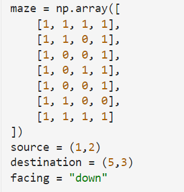
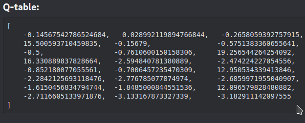

## * **note: old code (utilizing path finding algorithms in snake-game-environment) is in branch: ["old-code"](https://github.com/AGI-RESEARCH-SEC/snake-game-env/tree/old-code)**

 
 

# Introduction:
 * snake game to test how a toy car can be made autonomous

# Approach-1: Using Raspberry pi
* incomplete-code: `model_training_fixed_destination.ipynb`, `model_training_random_destination.ipynb`, `model_training.ipynb`, `generate_data.ipynb`
* The above code contains data and models for "Decision tree classifier" and "logistic regression". They use `[vectorized_coordinates, distance_between_source_and_destination]` as state and `['left', 'right', 'forward', 'backward']` as action.
* We originally intended to use DQN that uses `[camera_data, vectorized_coordinates, distance_between_source_and_destination]` as state and `['left', 'right', 'forward', 'backward']` as action.
* Raspberry pi stopped working so we implemented simple Q-learning in Arduino.

# Approach-2: Q-learning in Arduino
* code: `q-learning.ipynb`, q_learning_main.py
* hardware: Three ultrasonic sensors (one facing left, another right and third one facing the front), a magnetometer
* each ultrasonic sensor give distance from wall. we obtained three states as: `state_1 = "path" if distance > 30cm else "obstacles"`
* it had three actions: "left", "right" and "forward".
* 2^3 = 8 states and three actions give us a q table with 24 values.
* We trained the RL agent using Q-Learning in a simulated maze where it learn to make decisions in given state.
* 
* We then flattened those weights and inserted them in arduino code to make decisions in given state.
* In hardware, we used three ultrasonic sensors facing Forward, Lelft and Right. States is obtained by ultrasonic sensors. The state is either 0 or 1. So there are three states. Any obstacle within 30 cm gives state of '1' which indicate obstacle and '0' if there is no obstacle within 30 Cm which indicates the open path.
* So in each position, the agent gets three states which are used to get action in that state using trained weights from the simulated environment.
**Turning using magnetometer**: Turnings in our maze were at the right angle, so we used a magnetometer to turn left or right. For instance: if the agent is moving towards 100° and it has to turn right, the new angle should be 100 + 90 = 190°. so the agent is rotated until it faces 190°. However magnetometer readings were not consistent i.e. Readings when facing towards the same direction fluctuated.
**Path Caliberation Using Left/Right Distance**: While moving forward, coltrol left/right motor speed based on distance from left and right wall so as to move towards the center of path.

# Note:
    * fixed destination: it means source is random but destination is fixed
    * random destination: it means both source and destination are random.
    * Decision Tree classifier gives 100% accuracy for both fixed destination and random destination
