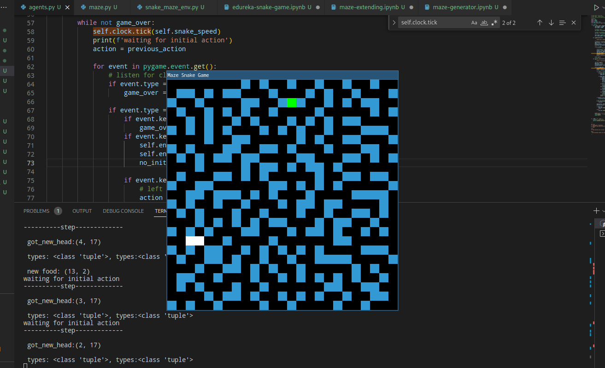

# Run the code:
* `pip install -r requirements.txt`

* `python3 main.py`

### **you can play game and it looks something like this:**    

### Note:
    * White is the snake
    * Green is the food
    * Blue is the maze wall